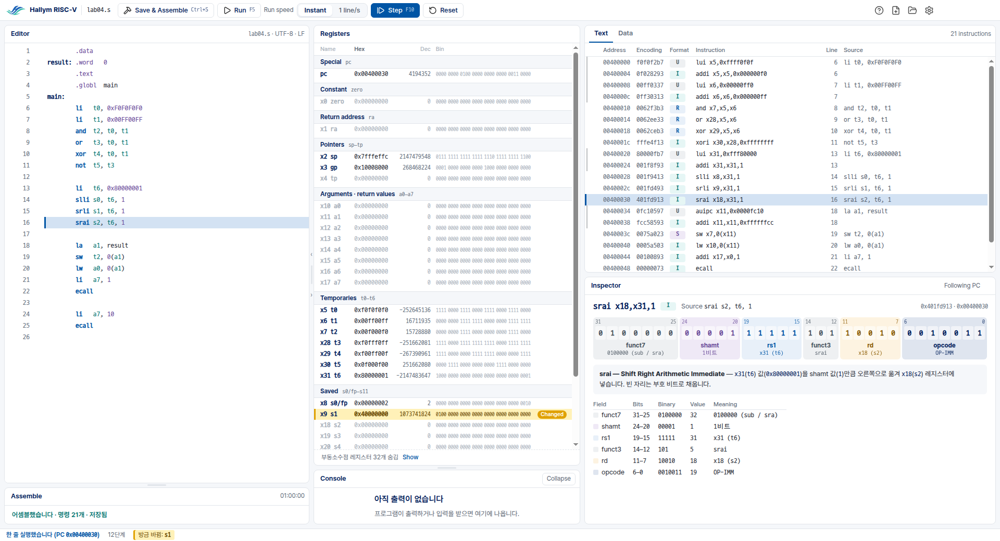

# Hallym RISC-V Simulator

한림대학교 컴퓨터구조 수업용 RISC-V 시뮬레이터입니다. RISC-V 어셈블리를 쓰고, 어셈블하고,
한 줄씩 실행하면서 레지스터와 메모리, 명령의 32비트가 어떻게 바뀌는지 봅니다.
[Hallym MIPS Simulator](https://github.com/ars2323/hallym-mips-simulator) 의 RISC-V 판이고,
어셈블러와 시뮬레이터는 [RARS](https://github.com/TheThirdOne/rars) 1.6 을 고치지 않고 씁니다.

**내려받기:** [최신 릴리스](https://github.com/ars2323/hallym-riscv-simulator/releases/latest)의
`HallymRISCV-<버전>-win-x64-setup.exe` (Windows 10/11, 64비트). 관리자 권한 없이 내 계정에만
설치되고, Java 를 따로 깔 필요가 없습니다(설치본에 들어 있습니다).

**사용법:** [사용 안내](docs/usage/usage.ko.md) — 설치, 첫 프로그램, 화면의 각 패널.

## 무엇을 볼 수 있나

- **Registers** — `x10 a0` 처럼 번호 이름과 쓰임새 이름(ABI 이름)을 함께, 호출 규약의 묶음대로.
  방금 바뀐 레지스터는 노란 줄. 부동소수점 레지스터는 64비트 그대로.
- **Text** — 주소, 기계어, 명령, 원래 소스 줄. 의사 명령(`li`, `la`)이 몇 개의 명령이 되는지.
- **Inspector** — 명령 하나를 여섯 형식(R, I, S, B, U, J)의 필드로 나누고, 흩어진 즉시값 조각이
  하나의 수로 모이는 모습(B 와 J 의 늘 0 인 맨 아래 비트, 부호 확장까지).
- **Data** — `.data` 의 라벨과 값, 스택.
- **Console** — 출력과 입력(`ecall`).
- 오류는 RARS 의 원문 그대로, 오타로 보이면 맞는 이름의 추측과 함께(`srll` → 혹시 `srl`?,
  MIPS 습관인 `$t0`, `syscall` 도).
- 처음 여는 사람을 위한 21단계 튜토리얼.

## 이 저장소

| 경로 | 무엇 |
|---|---|
| `electron/` | 앱 (Electron). Hallym MIPS Simulator v2.7.1 의 Electron 판을 같은 경로로 가져와 RISC-V 로 고친 것 — [무엇을 그대로, 무엇을 고쳐 가져왔나](electron/docs/FROM-MIPS.md) |
| `probe/` | 엔진: RARS 를 감싸는 stdio JSON 래퍼(`src/RarsProbe.java`)와 그 검사·측정 — [1단계 보고](probe/REPORT.md) |
| `docs/engine-protocol.md` | 앱과 엔진 사이의 계약 |
| `docs/usage/` | 사용 안내 |
| `NOTICE` | 설치본에 들어 있는 구성 요소와 그 조건 |

### 개발

JDK 21 (jlink 포함; 배포본은 Eclipse Temurin 21.0.12+1 로 만듭니다)과 Node.js 22 가 필요합니다.

    .claude/hooks/session-start.sh   # RARS 를 고정 커밋에서 빌드, 엔진 빌드, npm ci (멱등, root 불필요)
    cd electron
    npm run electron                 # 앱 실행
    npm test                         # 단위 검사 (실제 엔진으로)
    npm run e2e                      # 실제 창에서 e2e (Linux 는 xvfb-run)
    node tools/package.ts            # Windows 설치본 (Windows 에서)

검사와 배포는 CI 가 합니다: `.github/workflows/electron.yml` (Linux, 네 폭과 1920, Windows 설치본과
설치된 앱의 e2e, 업그레이드, 태그의 발행), `release-check.yml` (발행된 설치본을 내려받아 다시 검사),
`mutants.yml` (뮤턴트 전체), `ci.yml` (엔진과 탐침). 규칙은 [CLAUDE.md](CLAUDE.md).
