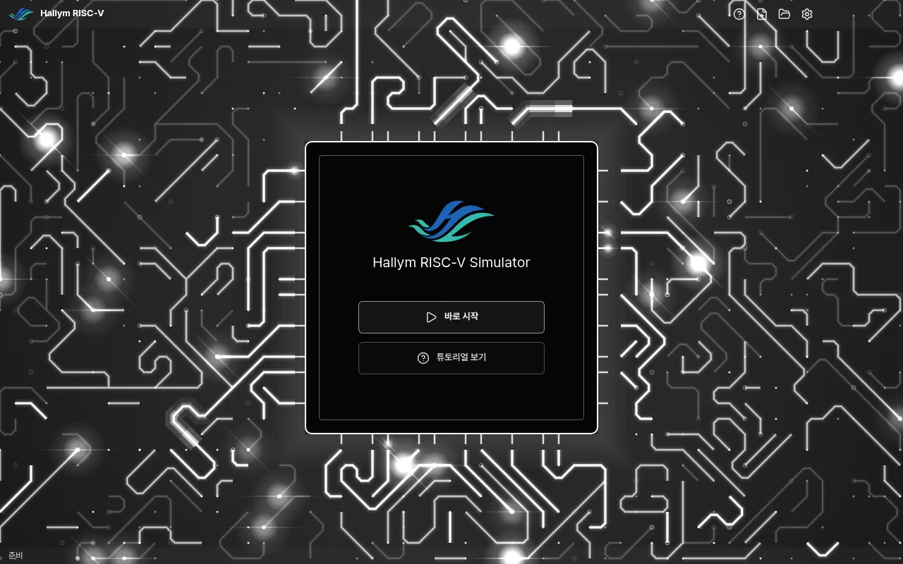
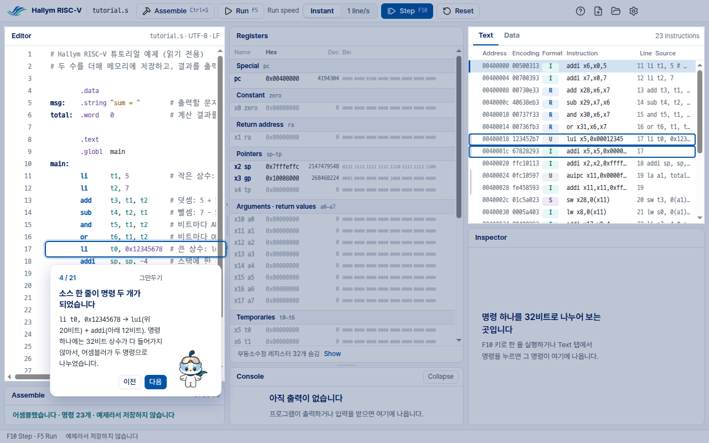
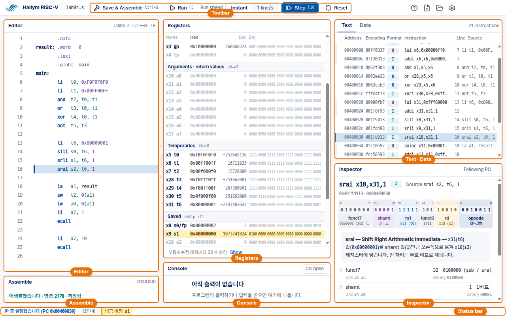

# Hallym RISC-V 사용법

Hallym RISC-V 는 한림대학교 컴퓨터 구조 실습에서 쓰는 RISC-V 시뮬레이터입니다. RISC-V 어셈블리를 쓰고,
어셈블하고, 한 줄씩 실행하면서 레지스터와 메모리, 명령어의 32비트가 어떻게 바뀌는지 봅니다.
어셈블러와 시뮬레이터는 RARS 1.6 이고, 오류 메시지도 RARS 의 원문 그대로 나옵니다.

**처음이라면 1 → 2 → 3 순서대로 읽으세요.** 특히 2번(Windows 경고 창)에서 멈추는 학생이 많습니다.

1. [내려받기](#내려받기)
2. [Windows 경고 창 넘기기](#windows-경고-창-넘기기) ← 꼭 읽으세요
3. [설치와 실행](#설치와-실행)
4. [처음 열었을 때: 시작 화면과 튜토리얼](#처음-열었을-때-시작-화면과-튜토리얼)
5. [화면 훑어보기](#화면-훑어보기)
6. [첫 프로그램](#첫-프로그램)
7. [자주 막히는 곳](#자주-막히는-곳)
8. [키보드](#키보드)
9. [MIPS 판에서 넘어왔다면](#mips-판에서-넘어왔다면)

---

## 내려받기

[릴리스 페이지](https://github.com/ars2323/hallym-riscv-simulator/releases/latest)에서
`HallymRISCV-<버전>-win-x64-setup.exe` **한 파일**을 받습니다. 설치 프로그램이고, Windows 64비트용입니다.

- 관리자 권한은 필요 없습니다. 지금 로그인한 사용자에게만 설치됩니다. 시작 메뉴에 등록됩니다.
- Java 를 따로 설치하지 않습니다. 시뮬레이터가 쓰는 Java 실행 환경이 설치본에 들어 있습니다.
- Hallym MIPS 가 설치돼 있어도 그대로 둔 채 옆에 설치됩니다. 둘은 서로 건드리지 않습니다.

### 브라우저가 다운로드를 막을 때

Edge 나 Chrome 이 *"일반적으로 다운로드되지 않는 파일"* 이라며 경고할 수 있습니다.
받는 사람이 아직 적은 파일에 붙는 경고입니다.

- **Edge:** 받기가 끝나면 오른쪽 위에 다운로드 목록이 열리고, 파일 이름 아래에 경고 문구가 나옵니다.
  그 줄에 마우스를 올리면 오른쪽 끝에 **…** 단추가 나타납니다. **…** → **유지** 를 누르면 작은 창이 뜨는데,
  거기서 **자세히 표시** 를 펼친 뒤 **그래도 계속** 을 누릅니다. 그러면 파일이 다운로드 폴더에 남습니다.
- **Chrome:** 다운로드 목록의 그 파일 줄에서 **계속** 또는 **유지** 를 누릅니다.

---

## Windows 경고 창 넘기기

이 프로그램에는 코드 서명이 없습니다. 그래서 **처음 실행할 때 Windows 가 반드시 경고합니다.**
화면 가운데에 파란 창이 뜹니다. 창 맨 위에 큰 글씨로 **"Windows의 PC 보호"** 라고 쓰여 있고,
그 아래 본문은 Microsoft Defender SmartScreen 이 인식할 수 없는 앱의 시작을 막았다는 두세 줄의 설명입니다.
이때 창 오른쪽 아래에는 버튼이 **"실행 안 함"** 하나뿐입니다.
**여기서 [실행 안 함] 을 누르면 프로그램이 열리지 않습니다.** 아래처럼 하세요.

1. 본문 설명 바로 아래, 왼쪽에 밑줄이 그어진 **"추가 정보"** 라는 글자가 있습니다. 링크입니다. 이것을 누릅니다.
2. 창이 바뀝니다. 본문 아래에 두 줄이 새로 생깁니다.
   - **앱:** `HallymRISCV-…-setup.exe`
   - **게시자:** 알 수 없는 게시자

   그리고 오른쪽 아래의 버튼이 **하나에서 둘로** 늘어납니다. 왼쪽이 **"실행"**, 오른쪽이 **"실행 안 함"** 입니다.
   **왼쪽의 [실행]** 을 누릅니다.
3. 설치가 진행됩니다(다음 절).

"게시자: 알 수 없는 게시자" 는 코드 서명이 없어서 나오는 말입니다. **앱:** 줄의 파일 이름이 방금 받은 파일과 같은지
확인하고 **[실행]** 을 누르세요.

경고는 **그 파일로 처음 실행할 때 한 번**만 나옵니다. 설치한 뒤 시작 메뉴로 열 때는 다시 나오지 않습니다.

### 그래도 안 열릴 때

- **"이 앱은 차단되었습니다" / "관리자가 차단했습니다"** 처럼 **[실행] 버튼이 아예 없는 창**이 뜨면,
  그 PC 의 관리 정책이 막은 것입니다. 학생이 넘길 수 없습니다. 실습실이라면 조교나 담당자에게
  알리세요. 개인 PC 라면 백신 프로그램의 차단 기록을 확인하세요.
- 백신이 파일을 지웠다면 다시 받고, 백신의 예외 목록에 추가합니다.

---

## 설치와 실행

1. 받은 `HallymRISCV-<버전>-win-x64-setup.exe` 를 실행합니다(경고 창은 [앞 절](#windows-경고-창-넘기기)).
2. 묻는 것 없이 바로 설치가 시작되고, 진행 막대가 나옵니다.
3. **설치가 완료되었습니다** 화면에서 **지금 실행하기** 칸을 체크한 채로 **마침** 버튼을 누르면 프로그램이 바로 열립니다.
4. 다음부터는 **시작 메뉴 → Hallym RISC-V** 로 엽니다. (바탕 화면 바로 가기는 만들지 않습니다.)

설치 위치는 `%LOCALAPPDATA%\Programs\Hallym RISC-V` 입니다. 새 버전을 받아 다시 설치하면
같은 자리에 덮어써집니다.

**지우기:** 설정 → 앱 → 설치된 앱 → *Hallym RISC-V x.y.z* → 제거.

### 이 프로그램이 기억하는 것

**아무것도 기억하지 않습니다.** 실습실 PC 는 여러 학생이 함께 쓰므로, 누가 켜든 늘 같은 화면에서 시작합니다.

- 실행하는 동안에는 바꿀 수 있습니다: 설정(톱니 버튼)의 **글자 크기**와 **Data 진법**,
  Ctrl + = / Ctrl + − 로 바꾼 글자 크기, 접은 패널, 창 크기.
- 프로그램을 끄면 모두 처음 값으로 돌아갑니다. 열었던 파일, 튜토리얼 진행 상태도 마찬가지입니다.
- 실행 중에는 화면을 그리는 데 필요한 임시 파일을 `%TEMP%\HallymRISCV\` 안에 두고, 끄면 지웁니다.
  컴퓨터가 갑자기 꺼져 남은 것은 다음에 켤 때 지웁니다.
- 시뮬레이터 엔진(Java)은 프로그램이 띄우고 프로그램과 함께 끝납니다. 프로그램이 비정상으로 끝나도
  엔진이 남지 않습니다.
- 남는 것은 학생이 **직접 저장한 `.s` 파일**뿐입니다.

---

## 처음 열었을 때: 시작 화면과 튜토리얼

프로그램을 열면 시작 화면이 나옵니다. 가운데 칩 모양의 카드에서 회로 기판이 8초쯤에 걸쳐 바깥으로 자라
나가고, 다 자란 뒤에는 몇 줄기 빛만 움직입니다(Windows 에서 애니메이션 효과를 끈 PC 에서는 다 자란 기판이
처음부터 멈춰 있습니다). 시작 화면에서는 위쪽 띠가 비어 있습니다. 설정과 도움말은 파일을 연 뒤 오른쪽 위에
나옵니다. 선택지는 둘입니다.

- **바로 시작** — **새 파일** 또는 **파일 열기**(Ctrl+O).
- **튜토리얼 보기** — 처음이라면 이것. 21단계로 화면을 하나씩 짚어 줍니다.



### 튜토리얼 21단계

튜토리얼은 예제 프로그램(`tutorial.s`)을 열어 두고 실제 화면을 한 곳씩 가리킵니다.
가리키는 곳이 들어 있는 패널은 통째로 밝게 두고, 그 안에서 볼 곳을 파란 테두리로 두릅니다. 나머지는 옅게 덮습니다.
설명 카드는 가리키는 곳 바로 아래(자리가 없으면 위나 옆)에 뜹니다.
밝은 곳이라도 누를 수 있는 것은 테두리 안뿐입니다.

| 단계 | 무엇을 배우나 |
|---|---|
| 1–4 | Editor, Assemble, Registers(이름이 둘씩: `x5` 와 `t0`), Text — 소스 한 줄이 기계 명령 여러 개가 되기도 한다는 것 |
| 5–9 | 한 줄 실행(Step), 방금 바뀐 레지스터, 16진·10진·2진, Inspector 의 32비트 |
| 10–13 | Data 탭, 라벨, `sw` 로 메모리가 바뀌는 것, 스택 |
| 14–17 | 브레이크포인트, Run, 천천히 실행(1 line/s), Reset |
| 18–21 | Console 출력, 어셈블 오류가 났을 때, 오류 난 줄로 가서 고칠 곳 보기, 마무리 |

- 설명 단계는 **[다음]** (또는 → 키)으로 넘어갑니다.
- 실습 단계의 카드에는 **[다음]** 이 없습니다. 카드에 적힌 대로 해 보세요(예: F10 키). 해내면 다음으로 넘어가거나,
  카드가 그 결과(바뀐 레지스터, 메모리의 값, Console 의 출력 …)를 가리키며 **[다음]** 을 기다립니다.
  잘 안 되면 몇 초 뒤 나타나는 **[건너뛰기]** 를 누르세요. 튜토리얼이 대신 해 줍니다.
- **[이전]** (← 키)으로 돌아갈 수 있고, **[그만두기]** (Esc 키)로 언제든 끝낼 수 있습니다.
- 예제는 **읽기 전용**이라 고쳐지지 않습니다. 튜토리얼을 끝내면 예제는 닫히고,
  튜토리얼 전에 보던 화면(또는 파일)으로 돌아갑니다. 저장하지 않은 파일이 있었다면 먼저 물어봅니다.
- 진행 상태는 저장되지 않습니다. 프로그램을 껐다 켜면 튜토리얼은 1단계부터입니다.
- 오른쪽 위 **물음표(?) 버튼**으로 언제든 다시 볼 수 있습니다.



위 그림은 4단계입니다. Editor 패널의 `li` 한 줄과, 그 줄이 된 Text 패널의 두 행(`lui`, `addi`)을 함께 가리킵니다.

---

## 화면 훑어보기

파일을 열면 왼쪽에 **Editor**, 오른쪽에 **Run** 쪽이 있습니다. 화면의 이름은 영어로 되어 있습니다.



| 이름 | 무엇 |
|---|---|
| **툴바** | **Save & Assemble**(Ctrl+S: 저장한 뒤 어셈블. 튜토리얼 예제는 저장하지 않으므로 **Assemble** 버튼이 되고, 좁은 창에서도 줄여서 **Assemble** 버튼) · **Run**(F5, 실행 중에는 **Stop**) · **Run speed**(Instant / 1 line/s) · **Step**(F10) · **Reset**. 오른쪽 끝은 튜토리얼(?) · 새 파일 · 파일 열기 · 설정 |
| **Editor** | 어셈블리 코드를 쓰는 곳. 줄 번호 왼쪽 칸을 누르면 **브레이크포인트**(빨간 점). 실행 중에는 지금 실행할 줄이 **파란 띠**로 보입니다 |
| **Registers** | 32개 정수 레지스터와 PC. 레지스터마다 이름이 둘입니다: `x10 a0` 처럼 번호 이름(`x10`)과 쓰임새 이름(ABI 이름, `a0`). 코드에는 어느 쪽을 써도 같은 레지스터입니다. 쓰임새별로 묶여 있고(Arguments · return values, Temporaries, Saved …), 방금 바뀐 레지스터는 **노란 줄**(넓은 창에서는 줄 끝에 **Changed** 표). **Hex** · **Dec** · **Bin** 은 같은 값의 16진·10진·2진. 아래쪽 **부동소수점** 묶음(f0–f31)은 **Show** 로 펼치고, 64비트 그대로 보여 줍니다(단정밀도 값은 float 로, 배정밀도는 double 로) |
| **Text** | 어셈블된 기계 명령 목록: **Address** · **Encoding**(32비트를 16진으로) · **Format**(R/I/S/B/U/J) · **Instruction**. 소스 한 줄이 명령 여러 개가 되면(`li` 의 큰 상수, `la`) 여러 행이 됩니다. 행을 누르면 Inspector 가 그 명령을 보여 줍니다 |
| **Data** | Text 옆 탭. 메모리(`.data` 에 쓴 것, 스택)를 4바이트 워드로, 한 행에 넷씩. 라벨 이름이 그 주소 위에 표시되고, `sp` · `gp` · `fp` 가 가리키는 곳도 보입니다. **ASCII** 열은 같은 바이트를 글자로 보여 줍니다(창이 좁으면 **+ ASCII** 로 켭니다) |
| **Inspector** | 명령 하나를 32비트로 풀어 보여 줍니다: 형식(R, I, S, B, U, J)의 필드별 색, 필드마다 값과 뜻, 그 명령이 하는 일을 한 문장으로. 즉시값이 있는 명령은 그 아래에 한 줄이 더 있습니다: RISC-V 는 즉시값을 조각내 명령 곳곳에 흩어 두는데, 그 조각들이 제자리에 모여 하나의 수가 되는 모습입니다. B 형식과 J 형식의 맨 아래 비트(늘 0 이라 명령에 없는 비트)와 부호 확장까지 보입니다 |
| **Console** | 프로그램의 출력(`ecall`). 입력을 받는 `ecall` 이면 여기에 입력 칸이 나옵니다. 출력이 없는 동안에는 한 줄짜리 안내만큼 낮고, 출력이 생기면 커집니다 |
| **Assemble** | Editor 아래. 마지막 어셈블의 결과: 성공하면 언제 어셈블했는지와 명령 수(저장 여부도), 실패하면 무엇이 잘못됐는지와 할 일, 틀린 줄마다 RARS 의 메시지와 (오타로 보이면) 맞는 이름의 추측, **N행으로 가기** 버튼. 위쪽 경계를 끌어 높이를 바꿀 수 있습니다(두 번 누르면 원래대로) |
| **상태 표시줄** | 맨 아래. 지금 상태(한 줄 실행했습니다, 브레이크포인트에서 멈췄습니다 …), 단계 수, 방금 바뀐 레지스터(노란 칸 *방금 바뀜: …*). 시뮬레이터 엔진이 준비 중이면 *엔진 준비 중…* 이 잠깐 보입니다 |

창이 좁으면(노트북 화면 배율이 큰 경우 등) Editor 와 Run 이 한 번에 하나씩 보이고,
위쪽 막대의 **Editor | Run** 탭으로 바꿉니다. 폭이 모자라 숨은 열은 패널 머리의
**+ Bin**, **+ Source** 같은 버튼으로 다시 켤 수 있습니다.

Editor 와 Run 사이, Registers 와 Console 사이의 경계는 끌어서 넓히거나 좁힐 수 있습니다.
경계를 두 번 누르면 처음 크기로 돌아갑니다.

---

## 첫 프로그램

1. **새 파일**(시작 화면의 *바로 시작 → 새 파일*, 또는 오른쪽 위 버튼)을 누르고 아래를 입력합니다.

   ```asm
           .data
   msg:    .string "hello\n"
           .text
   main:   li      t0, 5
           li      t1, 7
           add     t2, t0, t1      # t2 = 12
           li      a7, 4           # ecall 4: 문자열 출력
           la      a0, msg
           ecall
           li      a7, 10          # ecall 10: 끝
           ecall
   ```

   이미 있는 파일은 **파일 열기**(Ctrl+O)로 엽니다.

2. **Ctrl+S** 를 누릅니다(툴바의 **Save & Assemble** 버튼도 같습니다). 저장과 어셈블이 한 번에 됩니다.
   처음 저장이면 저장할 위치를 묻고, 그 창을 닫으면 저장하지 않고 어셈블만 합니다.
   성공하면 오른쪽에 Registers · Text · Inspector · Console 이 켜지고, Editor 아래 **Assemble** 패널에 결과가 나옵니다.
   실패하면 **Assemble** 패널에 오류가 나옵니다([자주 막히는 곳](#자주-막히는-곳)).
3. **F10**(Step)을 누를 때마다 한 줄씩 실행됩니다. Editor 의 파란 띠가 다음에 실행할 줄,
   Registers 의 노란 줄이 방금 바뀐 레지스터입니다. `add` 를 실행하면 `x7 t2` 줄이 12(`0x0000000c`)가 됩니다.
   RISC-V 프로그램은 시작 코드 없이 `main` 의 첫 줄에서 바로 시작합니다.
4. **F5**(Run)로 끝까지 실행합니다. Console 에 `hello` 가 나오고,
   상태 표시줄에 *"프로그램이 끝났습니다"* 가 나옵니다.
5. 처음부터 다시 하려면 **Reset**. 마지막으로 어셈블한 프로그램이 처음 상태로 돌아갑니다(다시 어셈블하지는 않습니다).

**코드를 고쳐도 오른쪽은 그대로입니다.** 레지스터와 메모리를 보면서 고칠 수 있도록, 오른쪽은 마지막으로 어셈블한
코드를 계속 보여 주고 그 위에 한 줄로 *"지금 보이는 것은 마지막으로 어셈블한 코드입니다"* 라고 알려 줍니다.
F10 · F5 · Reset 도 그 프로그램으로 계속됩니다. 이때 Editor 에는 파란 띠가 없습니다(고친 코드의 줄은 실행 중인
프로그램의 줄이 아니라서입니다). 실행 위치는 Text 탭에서 보세요. 고친 코드는 **Ctrl+S** 로 어셈블하면 적용됩니다.
고친 코드에 오류가 있으면 오류는 **Assemble** 패널에 나오고, 오른쪽은 그대로 남습니다.

---

## 자주 막히는 곳

**프로그램이 안 열린다 / 파란 경고 창이 뜬다** — [Windows 경고 창 넘기기](#windows-경고-창-넘기기).

**어셈블이 안 된다** — Editor 아래 **Assemble** 패널을 보세요. 틀린 줄마다 RARS 의 메시지와, 오타로 보이면
맞는 이름의 추측(*`srll` 명령은 없습니다. 혹시 `srl`?*)이 적혀 있습니다.
**N행으로 가기** 를 누르면 그 줄로 갑니다. Editor 에는 그 줄 옆에 `!` 표시가 있습니다. 고친 뒤 **Ctrl+S** 키를 다시 누르세요.
흔한 원인은 명령 이름 오타(`adi` → `addi`), 없는 레지스터(`t7`: `t` 레지스터는 `t0`–`t6`), MIPS 습관(`$t0` → `t0`,
`syscall` → `ecall`), 빠진 쉼표입니다.

**F5 를 눌렀는데 끝나지 않는다** — 프로그램이 끝없이 돌거나(루프 조건 확인), 입력을 기다리는 중입니다.
- **Esc** 또는 **Stop** 으로 멈춥니다. 멈춘 자리의 레지스터와 메모리를 볼 수 있습니다.
- Console 에 입력 칸이 보이면, 값을 입력하고 **Enter** 를 누르세요. 입력을 기다리다 멈추면 그 `ecall` 은
  실행하지 않은 것으로 돌아가고, 다시 실행하면 입력을 다시 받습니다.

**브레이크포인트를 찍었는데 안 걸린다** — 명령이 없는 줄(빈 줄, 주석, 라벨만 있는 줄)에는
걸리지 않습니다. 명령이 있는 줄에 찍으세요. 어셈블하기 전에 찍은 점과 코드를 고친 뒤에 찍은 점은 다음에
어셈블할 때(Ctrl+S) 적용되고, 다시 어셈블해도 점은 그 줄에 그대로 남습니다.

**오른쪽이 비어 있다 / "아직 어셈블하지 않았습니다"** — **Ctrl+S** 키나 **Save & Assemble** 버튼을 누르세요.

**"시뮬레이터 엔진이 멈췄습니다"** — 드문 일이지만 엔진(Java)이 끝나 버리면, 프로그램이 엔진을 새로 띄우고
그렇다고 알려 줍니다. 프로그램은 지워졌으니 **Ctrl+S** 로 다시 어셈블하세요. 계속 반복되면 조교에게 알려 주세요.

**"지금 보이는 것은 마지막으로 어셈블한 코드입니다"** — 어셈블한 뒤에 코드를 고쳤다는 뜻입니다. 오른쪽과 실행은
고치기 전의 코드입니다. 고친 코드로 하려면 **Ctrl+S** 로 다시 어셈블하세요.

**2진수(Bin)나 Encoding 열이 안 보인다** — 창이 좁아 숨은 것입니다. 창을 넓히거나 패널 머리의
**+ Bin** / **+ Encoding** 을 누르세요.

**글자가 너무 작다/크다** — **Ctrl + =** / **Ctrl + −**, 또는 설정(톱니)의 글자 크기. 어느 쪽이든 이번 실행에만
적용됩니다. 끄고 다시 켜면 처음 크기입니다([이 프로그램이 기억하는 것](#이-프로그램이-기억하는-것)).

**한글 주석이나 한글 출력** — 쓸 수 있습니다. 파일은 원래 인코딩(UTF-8, 또는 예전 파일의 CP949) 그대로 저장되고,
`.string` 의 한글은 Console 에 그대로 나옵니다.

**어느 판인지 모르겠다** — 설정(톱니) → **About · Licenses** 에 버전과 RARS 버전이 나옵니다.

---

## 키보드

| 키 | 하는 일 |
|---|---|
| Ctrl+S | 저장하고 어셈블 |
| F10 | 한 줄 실행 (Step) |
| F5 | 실행 (Run) / 브레이크포인트에서 이어서 |
| Esc | 실행 멈춤 (Stop) |
| Ctrl+O | 파일 열기 |
| Ctrl + = / Ctrl + − / Ctrl + 0 | 글자 크게 / 작게 / 원래대로 (이번 실행에만) |
| Tab / Shift+Tab | Editor 에서 4칸 들여쓰기 / 내어쓰기 |

---

## MIPS 판에서 넘어왔다면

화면과 키는 Hallym MIPS 와 같습니다. 다른 것은 명령어 집합에서 오는 것들입니다.

| | Hallym MIPS | Hallym RISC-V |
|---|---|---|
| 레지스터 이름 | `$t0`, `$v0` | `t0`(= `x5`), `a7` — `$` 없음 |
| 시스템 호출 | `syscall`, 번호는 `$v0` | `ecall`, 번호는 `a7` |
| 문자열 | `.asciiz` | `.string` (또는 `.asciz`) |
| 시작 | 시작 코드(`__start`)를 지나 `main` | 바로 `main` 의 첫 줄 |
| 명령 형식 | R, I, J | R, I, S, B, U, J (Inspector 가 즉시값 조각을 모아 보여 줌) |
| 큰 상수 `li` | `lui` + `ori` | `lui` + `addi` |
| 실행 이미지(.hmx) 내보내기 | 있음 | 없음 |
